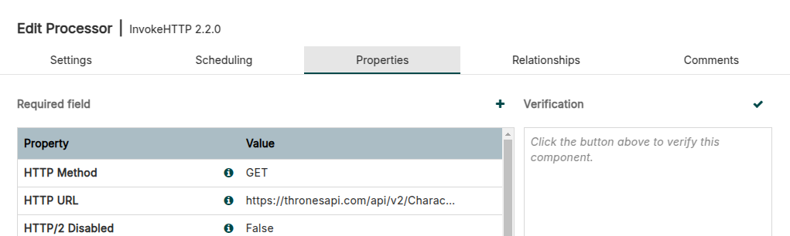
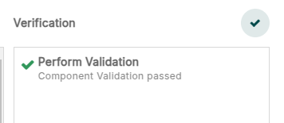

# 💧 Apache Nifi &mdash; 👣 Primeiros pasos

## Requisitos previos

Lembra seguir a [guía de instalación de Apache Nifi](docker-8-apache-nifi.md) antes de continuar con este documento.

## Creando contedores coas bases de datos

Creamos un servidor de MySQL

``` bash
docker volume create mysql4nifi_vol

docker run -p 9906:3306 --name mysql4nifi \
    -v mysql4nifi_vol:/var/lib/mysql \
    -e MYSQL_ROOT_PASSWORD=Nifi.My456 \
    -e MYSQL_DATABASE=nifi \
    -e MYSQL_USER=nifi \
    -e MYSQL_PASSWORD=Nifi.Abc123 \
    --restart unless-stopped -d mysql:8
```

Conectamos á base de datos:

``` bash
docker exec -it mysql4nifi mysql -hlocalhost -unifi -pNifi.Abc123 nifi
```

E pegamos o script:

``` sql
CREATE TABLE tronoPers(
    id INTEGER,
    firstName VARCHAR(100),
    lastName VARCHAR(100),
    fullName VARCHAR(100),
    title VARCHAR(100),
    family VARCHAR(100),
    image VARCHAR(255),
    imageUrl VARCHAR(255)
);

CREATE TABLE tronoCont(
    id INTEGER,
    firstName VARCHAR(100),
    lastName VARCHAR(100),
    fullName VARCHAR(100),
    title VARCHAR(100),
    family VARCHAR(100),
    image VARCHAR(255),
    imageUrl VARCHAR(255)
);

CREATE TABLE estrenosNet(
    videoID INTEGER,
    country CHAR(2),
    title1 VARCHAR(255),
    title2 VARCHAR(255),
    startTime TIMESTAMP,
    collection INTEGER,
    image TEXT,
    genre INTEGER
);
```

⚠️ **Non copies e pegues os seguintes comandos sen ler.**

Tan so se tiveses que crear a BBDD e o usuario a man porque xa teñas o servidor MySQL creado, sería así:

``` sql
CREATE DATABASE nifi;
CREATE USER 'nifi'@'%' IDENTIFIED BY 'Nifi.Abc123';
GRANT ALL PRIVILEGES ON nifi.* TO 'nifi'@'%';
FLUSH PRIVILEGES;
use nifi;
```

### Barra de ferramentas de Apache Nifi

A seguinte documentación foi elaborada empregando a versión: **2.2.0**.


### InvokeHTTP: Lendo arquivos JSON remotos

Imos facer dúas probas, unha cunha API chamada [ThronesAPI](https://thronesapi.com/) e outra real, a de [Netflix](https://about.netflix.com/es/new-to-watch).

#### ThronesAPI

A API de [ThronesAPI](https://thronesapi.com/) permítenos baixar directamente a información e ten documentación de uso.

Por exemplo, podemos arrastrar un novo procesador e seleccionar InvokeHTTP e nas propiedades empregar calquera das URL:

- <https://thronesapi.com/api/v2/Characters>
- <https://thronesapi.com/api/v2/Continents>

Dende o canvas de Nifi arrastramos un grupo de procesamento e lle chamamos *Trona2*. Facemos doble click dentro del para meternos e dentro do seu canvas arrastramos un procesador. No cadro de búsqueda poñemos que sexa de tipo: **InvokeHTTP**.

Facemos doble click no novo procesador InvokeHTTP e modificamos:

- Na lapela **Settings** cambiamos a súa propiedade **name** a **ThronesAPI**.
- Na lapela **Scheduling** deixamos o evento como Time driven, pero en **Run Schedule** mudamos os 0 segundos por **300 segundos**.
- Na lapela **Properties** mudamos o campo **HTTP URL** por: **https://thronesapi.com/api/v2/Characters**.
- Na lapela **Relationships** marcamos terminate nos casos: Failure, No Retry, e Retry.

Cando teñamos modificado todo, premeremos en Apply.

Facemos click dereito no procesador e seleccionamos **Change color** e poñemos unha cor vermella.

Volvemos a facer doble click no procesador e imos á lapela **Properties**, na parte superior dereita veremos Verification e un check ✔️.



Prememos no check para ver se o procesador supera todas as verificacións de debería verse todo en verde. Se tes algo mal, corríxeo antes de continuar. En xeral para case todos os controis, debemos primeiro aplicar e logo volver meternos e validar.

⚠️ **Lembra gardar os cambios antes de validar.** A maioría dos controis valídanse coa configuración anterior sen gardar a non ser que os gardemos explícitamente.




#### Netflix

Imos á páxina de [Netflix. New to Watch](https://about.netflix.com/es/new-to-watch) e prememos Ctrl+Shift+i para acceder á consola do desenvolvedor. Unha vez ahí imos a Network e despois filtramos por Fetch/XHR ([XMLHttpRequest](https://www.w3schools.com/xml/xml_http.asp)).


Despois cambiamos na web de lapela entre Películas e series por exemplo e veremos que aparece unha nova liña cunha petición. Facemos click dereito nela: *Copy* &rarr; *Copy URL*.


Se pegamos esa URL nunha nova lapela, veremos que nos da un JSON paxinado. Sen embargo, se tratamos de pegar esa URL no Nifi, dará un erro 403 (prohibido) xa que a web non permite que ferramentas automáticas se conecten a ela.

Podemos baixar o arquivo JSON a man e subilo a un servidor web noso para probar a descargalo dende ahí.

Ollo! Non tódolos datos que son públicos teñen licencia para ser empregados e voltos a publicar.


## Montar un servidor web para meter arquivos

Pode serche útil para non saturar os servidores dos que queiras baixarte información ou se che prohíben o acceso dende Nifi ou curl.

Con estes dous comandos crearás un directorio "web" dentro do teu home de usuario. Ahí poderás mover os documentos que queiras accesibles (por exemplo arquivos .json previamente descargados).

``` bash
mkdir -p $HOME/web

docker run --name nginx -p 80:80 \
  -v $HOME/web:/usr/share/nginx/html:ro \
  --restart unless-stopped -d nginx
```

### DBCPConnectionPool: Conexión coa BBDD

Precisamos saber a IP do servidor de base de datos:

``` bash
docker inspect mysql4nifi
```

Neste exemplo imaxinamos que é: **172.17.0.4**.

Para averiguar **Driver Class Name**, [se temos instalado DBeaver](dbeaver-tunel-ssh.md) podemos facer unha nova conexión de base de datos e premer en "Editar conexión", logo premeremos no botón "Driver settings" e miramos despois o nome de clase.

- **Database Connection URL**: jdbc:mysql://172.17.0.4:3306/nifi
- **Database Driver Class Name**: com.mysql.cj.jdbc.Driver
- **Database Driver Location(s)**:
    - Para versión 8: /opt/nifi/jdbc/mysql-connector-j-8.4.0.tar.gz
    - Para versión 9: /opt/nifi/jdbc/mysql-connector-j-9.2.0.jar
- **Database User**: nifi
- **Password**: Nifi.Abc123


## Ligazóns para mais información

- Titorial de Tutorial's Point: <https://www.tutorialspoint.com/apache_nifi/index.htm>
- Documentación oficial. Inicio rápido: <https://nifi.apache.org/docs/nifi-docs/html/getting-started.html>
- Documentación oficial. Manual do usuario: <https://nifi.apache.org/docs/nifi-docs/html/user-guide.html>
- Documentación oficial. Nifi en profundidade: <https://nifi.apache.org/docs/nifi-docs/html/nifi-in-depth.html>
- Titoriais en Youtube de InsightByte <https://www.youtube.com/playlist?list=PLkp40uss1kSI66DA_aDCfx02gXipoRQHc>