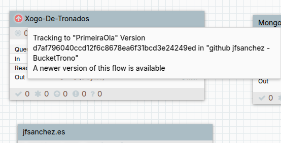
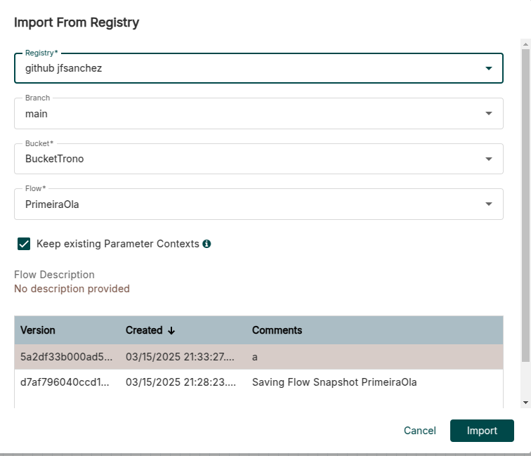
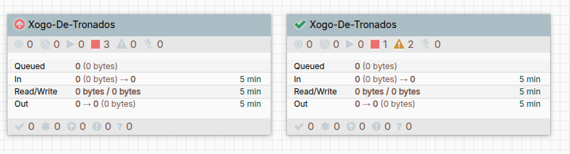

# 💧 Apache Nifi &mdash; 😼 Control de versións

Apache Nifi permite gardar as versións dos grupo de procesamento ou ben no Nifi Registry, Github ou Gitlab. Esto permite gardar o estado de cada grupo de procesamento permitindo volver atrás.

Tamén se podería facer un backup do arquivo flowfile.xml.gz pero isto implica facer unha copia manual de cada vez. Se queremos so unha copia, podemos facer click dereito no Canvas &rarr; **Download Flow Definition** &rarr; **With/Without External Services**.

Se queremos configurar calquera das opcións, iremos ao menú &rarr; **Controller Settings** &rarr; **Registry Clients** &rarr; +

## Configuración dun rexistro

Actualmente as explicacións completas están dispoñibles so para GitHub.

### GitHub

- GitHub: **GitHubFlowRegistryClient**. Na lapela **Properties**:
    - **Repository Owner**: Usuario de github.
    - **Authentication Type**: Personal Access Token.
    - **Personal Access Token**: Pegar o token xerado en GitHub.
    - **Default Branch**: main (ollo, se creamos manualmente master).
    - **Repository Path**: No caso de gardar nun directorio.

Se só precisamos acceso de lectura, non precisamos xerar un PAT, neste caso seleccionamos como **Autentication type: None**.

Creamos un directorio no repositorio que se chame: **BucketTrono**.

**Xerar un Personal Access Token**

En GitHub: **Settings** -> **Developer Settings** -> Menú dereito: **Personal Access Tokens** -> **Fine-grained tokens** -> **Generate new Token**.

Darlle un nome, unha expiración e en **Repository access** -> **Only select repositories** -> Marcar os repos aos que queremos darlle acceso.

Marcar os **permisos**:

- **Content** &rarr; **Access Read and Write**.
- **Commit statuses**  &rarr; **Access Read and Write**.

Premer no botón de **Generate token**.

### GitLab

(en elaboración) **GitLabFlowRegistryClient**

### Apache Nifi Registry

(en elaboración) Para montar un Nifi Registry empregado polo **NifiRegistryFlowRegistryClient**, existe unha imaxe co Nifi Registry: <https://hub.docker.com/r/apache/nifi-registry>.

## Versionar grupo

Dende o canvas principal, facemos click dereito no Proccess Group que nos interesa, por exemplo **Tronos** &rarr; **Version** &rarr; **Start Version Control**.

Se nos fixamos, agora o grupo ten un check en verde ao principio do nome indicándonos de este feito que está baixo o control de versións.

Se temos varios grupos de procesamento no mesmo "Bucket" (directorio ou cubo de almacenamento) cada un terá un nome diferente (Flow Name) rematado en .json.

Se facemos calquer cambio no grupo de procesamento e despois volvemos ao Canvas principal e prememos de novo con click dereito no grupo e vamos ás opcións de versións, podemos face run commit (e push) ao repositorio.

Se prememos en commit, podemos indicar a mensaxe.

E se imos ao repositorio, veríamos no directorio correspondente os arquivos .json.

## Volver a unha versión anterior

Podemos volver a unha versión anterior premendo con click dereito e seleccionando: **Version** &rarr; **Change version**.

Tamén veremos unha marca conforme hai unha nova versión dispoñible (útil por si actualizamos o repo dende outro sitio ou estamos empregando un fluxo doutra persoa).

## Importar un fluxo dun rexistro

Na barra de ferramentas, dende a opción **Import from Registry** tamén podemos arrastrar e crear un grupo de procesamento que xa estea no repositorio. Arrastramos a opción ao Canvas e seleccionamos o que queremos importar.

E como vemos, podemos ter dúas versións do mesmo grupo de procesamento para probalas.

