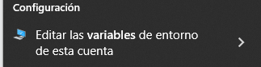

# 🐍 Conda: Contorno BigData


Este contorno permite facer os exercicios da clase. Imos instalar algunhas librarías básicas, o jupyterlab (para os notebook) e configurar o Visual Studio Code (vscode/code) por comodidade.

Pasos:

1. Baixa miniconda <https://repo.anaconda.com/miniconda/> e instálao no teu equipo. Para Microsoft Windows baixa o instalable, para GNU/Linux emprega:
    ``` bash
    wget https://repo.anaconda.com/miniconda/Miniconda3-latest-Linux-x86_64.sh
    chmod a+rx Miniconda3-latest-Linux-x86_64.sh
    ./Miniconda3-latest-Linux-x86_64.sh
    ```

2. (*Opcional*) Mete miniconda no **PATH** de Microsoft Windows. O instalador di que pode dar problemas, pero é só se temos configuracións previas que empreguen Python e nalgúns casos moi especiais (mira os pasos abaixo).
3. Actualiza tódolos paquetes do contorno base para que non dea problemas:
    ``` bash
    conda update --all
    ```

4. Borra o contorno bigdata anterior:
    ``` bash
    conda env remove -n bigdata
    ```

5. Crea o novo contorno bigdata e actívao:
    ``` bash
    conda create -n bigdata python=3.11
    conda activate bigdata
    ```

6. Instala os paquetes mínimos que imos precisar
    ``` bash
    conda install -c conda-forge jupyterlab ipykernel ipython \
       nbconvert pandas numpy pyarrow fastparquet wordcloud nltk \
       pymysql ipython-sql sqlalchemy selenium requests beautifulsoup4 \
       psycopg2
    ```

    ``` bash
    conda install pip
    ```

## Engadir miniconda ao PATH

### GNU/Linux 

O instalador ofrécenos por defecto inicializar conda e metela no PATH, deberíamos optar por esta opción.

Se non o fixemos e non queremos executar de novo o instalador coa opción -u, entón podemos engadir ao final do .bashrc (considerando que ocnda estea instalado na ruta por defecto e a nivel usuario):

``` bash
export PATH=$PATH:$HOME/miniconda3
```

### Microsoft Windows

O instalador tamén ofrece a posibilidade de meter conda no PATH pero o desaconsella, se non o fixeches (non é unha opción por defecto) entón, pódelo meter manualmente como se indica a continuación.

*Menú inicio -> Editar las variables de entorno de esta cuenta*




Premer en *"Editar..."*


Logo en *"Nuevo"* e engadir unha entrada por liña

Mirar cal das dúas aplica (mira os directorios e busca onde tes conda instalado)
~~~~
%USERPROFILE%\AppData\Local\miniconda3\condabin
%USERPROFILE%\Miniconda3\bin
~~~~

## Configurar Visual Studio Code (vscode) con conda e jupyterlab


### Instalar plugin de jupyterlab

Selecciona na roda de configuración (abaixo, esquerda) a opción *"Extensiones"*.

Busca *"Jupyter"* do autor *"Microsoft"* e instálao.


### Configurar a ruta base de conda

1. Vai á roda de configuración e selecciona configuración (En GNU/Linux: Ctrl+,).
2. Busca `conda path`.
3. No cadro pon a ruta ao executable de conda (conda.bat en Microsoft Windows)

``` bash
/home/USUARIO/miniconda3/bin/conda
```


### Configurar a terminal


1. Abre o code.
2. Abre unha terminal (En GNU/Linux: Ctrl+Shift+`, en Microsoft Windows: Ctrl+ñ) e escribir o comando (en Windows podemos especificar tamén powershell ao final):
    ``` bash
    conda init
    ```


3. Pecha tódolos terminais e xa podes abrir un que será inicializado no contorno base.
