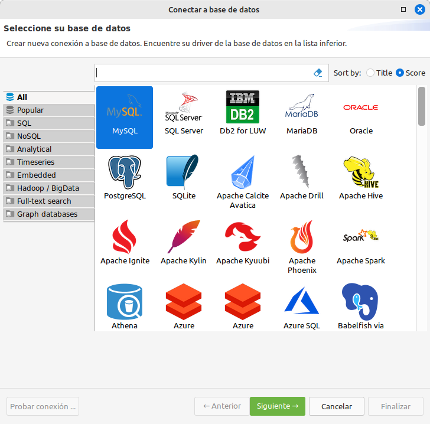
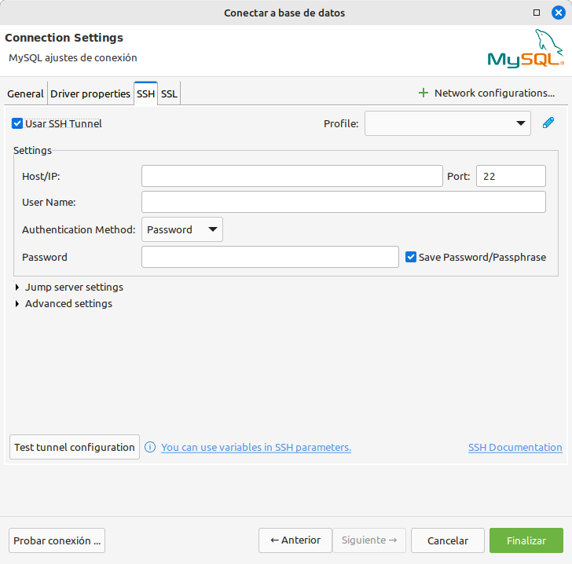

# 🦫 DBeaver e túneles SSH

DBeaver é un programa cliente SQL que permite ver, administrar e xestionar bases de datos. Emprega **[JDBC](https://es.wikipedia.org/wiki/Java_Database_Connectivity)** para conectarse.

É especialmente útil porque **detecta e descarga automáticamente** os drivers para moitos tipos diferentes de bases de datos.

Imos ver paso a paso como configurar unha conexión facendo uso dun túnel SSH simple (sen saltar por máis dun host).

Neste exemplo configuraremos un [servidor de MySQL](docker-1-my-maria.md) que temos instalado mediante [docker](docker-0-base-simple.md)

1. Seleccionamos o tipo de base de datos **MySQL**.

    

2. Na lapela **General** metemos a configuración básica: Usuario e contrasinal de base de datos, a propia base de datos á que imos conectar (**employees**) e metemos como servidor **localhost** e porto **3306** posto que imos redireccionar un porto hacia nos.

    

3. Na lapela **Driver properties** mudamos o valor de **allowPublicKeyRetrieval** a **TRUE** posto que é necesario no caso de empregar cifrado. Segundo a configuración, pode ser necesario.

    

4. Na lapela **SSH** dámoslle ao lápiz de editar (arriba á dereita, despois de **profile**). O motivo de facelo dende ahí é poder reutilizar este perfil con máis conexións a BBDD.

    

5. Abrirase unha nova ventana, activamos o check **Use SSH tunnel**.

    

6. Activaranse tódalas casiñas a curbir. Na parte de **Settings**, no **Host/IP** meteremos o enderezo IP do servidor de SSH e o porto por defecto 22. Cubrimos o usuario e seleccionamos o método de autenticación **Private Key**. Prememos no 📁 cartafol laranxa e buscamos a nosa chave privada (id_rsa ou equivalente se empregas outra diferente a RSA). No passphrase irá o contrasinal desta chave privada (se o arquivo está protexido).

    

7. Seguimos cubrindo datos na parte de **Advanced settings**. En Local host metemos a nosa IP do interfaz de loopback (127.0.0.1) para non expoñer o servizo á nosa rede, deixamos o porto por defecto 3306 posto que o puxemos no paso 2. En remote host metemos o servidor de BBDD ao que nos queremos conectar: 172.17.0.2 e porto por defecto: 3306.

    

8. Co perfil xa seleccionado, podemos premer no botón **Probar conexión** e finalmente en **Finalizar**

    

O programa ten opcións para múltiples saltos no caso que precises conectarte a varios servidores ata chegar á rede de producción.

Ollo, ten en conta que se fas múltiples saltos, a velocidade podería verse diminuida.
