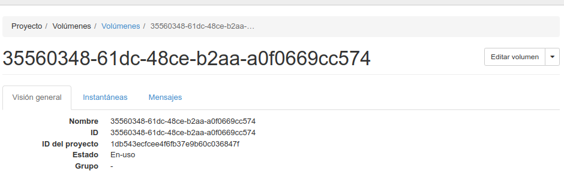
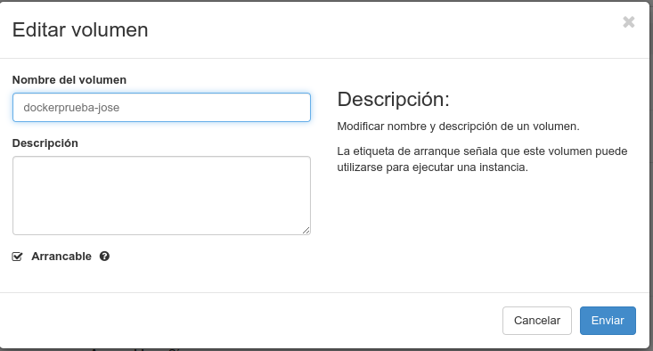
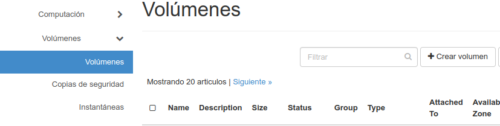
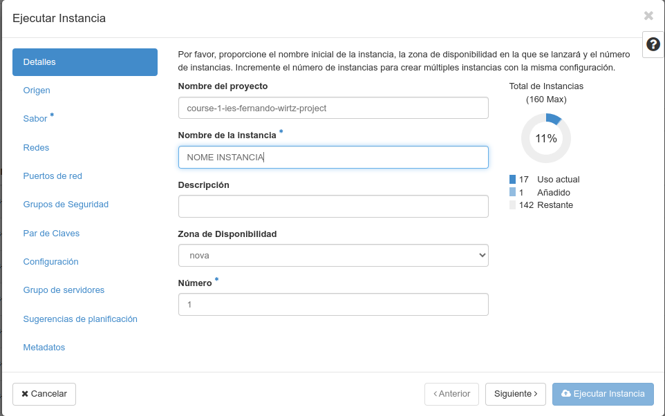
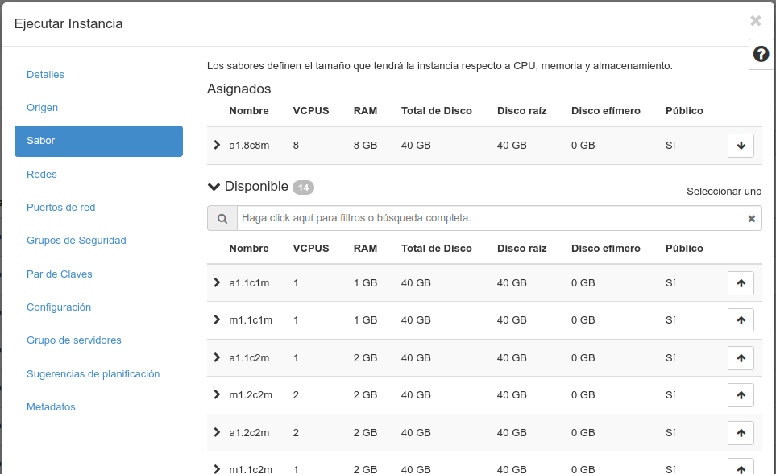
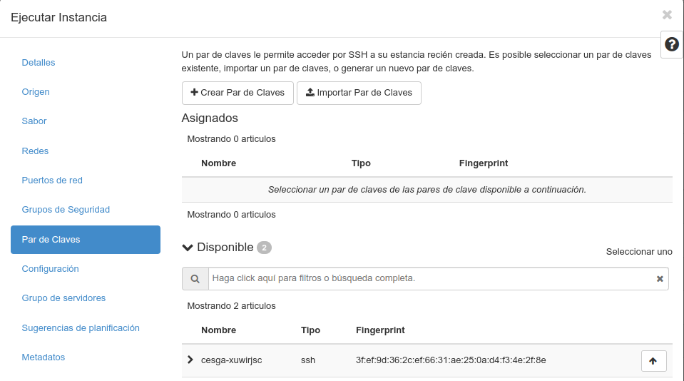

# 💿 OpenStack: Volumes

Normalmente os servizos de virtualización na nube cobran polo uso de recursos: Procesador, memoria RAM, rede, GPU, espacio en disco...

Non sempre necesitamos todos os servizos activos, polo que se queremos aforrar custos, debemos reducir recursos.

Un volume é o disco duro virtual onde se almacenan os datos das instancias en [OpenStack](https://www.openstack.org/).

Imos ver unhas operacións básicas sobre volumes en [OpenStack](https://www.openstack.org/) empregando o interfaz web Horizon de [Nova](https://docs.openstack.org/nova/latest/).

- Como cambiarlle o nome do volume a unha instancia.
- Como asociar/desasociar un volume dunha instancia.
- Como extender un volume.
- Como clonar un volume.
- Como borrar unha instancia.
- Como lanzar unha instancia a partir dun volume.


## Como cambiarlle o nome do volume a unha instancia.

Non é preciso nin desasociar o volume da instancia nin parala para renomear os volumes. Isto é útil para localizalos con posterioridade.

1. Imos a Computación &rArr; Instancias:

    

2. Prememos no nome da instancia e nos sairá información sobre a mesma, imos ao final da páxina e veremos os volumes asociados:

    

3. Tras premer no volume ao que queremos cambiarlle o nome, aparecerá información sobre o mesmo:

    

4. Prememos no botón "Editar volumen" e mudamos o nome ao que queiramos, seguidamente confirmamos os cambios no botón azul.

    

## Como asociar un volume a unha instancia en execución.

1. Imos a Computación &rArr; Instancias:

    

2. Prememos na frecha de "Crear instancia" da instancia correspondente para que nos apareza o menú:

    

3. Seleccionamos a opción "Asociar Volume", seleccionamos o volume que queremos asociar e prememos no botón azul para confirmar.

    

4. Debemos montar o volume no sistema operativo. Primeiro entramos na instancia (seleccionamos o nome no listado de instancias) e vemos ao final a qué dipositivo virtual se asociou o novo volume, neste caso a `/dev/vdb`

    

5. Montámolo co comando mount (ou de ser preciso formateamos). Podemos asegurarnos que exista correctamente dentro da máquina o interfaz virtual que vimos previamente no interfaz web co comando `lsblk` dende unha consola SSH.

    5.1 Opción 1: Para montar un volume:

    ``` bash
    lsblk
    sudo mkdir /mnt/vdb
    sudo mount /dev/vdb /mnt/vdb
    ```

    5.2 Opción 2: Para formatear (borra os datos) dun volume:

    ``` bash
    lsblk
    sudo mkdir /mnt/vdb
    sudo mkfs.ext3 /dev/vdb
    sudo mount /dev/vdb /mnt/vdb
    ```

6. Asegurámonos que estea correctamente montado executando o comando `mount` e vendo que aparece na listaxe.

## Como desasociar un volume

**Importante**: Se non queres perder datos, lembra apagar a instancia se lle vas a desasociar un volume. A outra opción é desmontar previamente o dispositivo.

**Nota**: Non se pode desasociar o volume raíz (o que contén o sistema operativo) dunha instancia en execución, para eso deberás apagala ou borrala. Se non tes marcada a opción de borrar o volume cando se borre a instancia, o volume non debería borrarse polo feito de eliminar a instancia.

Imos desasociar un volume adicional.

1. Buscamos o volume con calquera dos comandos:

    -  `mount`
    -  `lsblk`
    -  `df -h`

2. Desmontamos o volume:

    ``` bash
    umount /mnt/vdb
    ```

3. Imos á interfaz web &rArr; Computación &rArr; Instancias:

    

4. Prememos na frecha de "Crear instancia" da instancia correspondente para que nos apareza o menú:

    

5. Seleccionamos a opción "Desasociar Volume", seleccionamos o volume que queremos desasociar e prememos no botón azul para confirmar.

    


## Como extender un volume.

Se o volume é de sistema, debemos apagar a máquina (realmente pódese facer coa instancia encendida e logo reiniciar pero NON é recomendable).

1. Imos a Computación &rArr; Instancias:

    

2. Prememos no nome da instancia e nos sairá información sobre a mesma, imos ao final da páxina e veremos os volumes asociados:

    

3. Tras premer no volume que queremos extender, aparecerá información sobre o mesmo:

    

4. Prememos na frecha á dereita do botón "*Editar volumen* &darr;" e seleccionamos "*Extender Volumen*".

    

5. Poñemos o novo tamaño e confirmamos co botón azul. Finalmente volvemos encender a instancia ou ven a reiniciamos de estar encendida.

**Opción**: Se non é un volume de sistema, debemos desmontalo, cambiar o tamaño da partición e volvelo montar. Exemplo:

``` bash
lsblk
df -h
sudo umount /mnt/vdb
sudo e2fsck -f /dev/vdb
sudo resize2fs /dev/vdb
sudo mount /dev/vdb /mnt/vdb
lsblk
df -h
```

## Como clonar un volume.

Debe estar o volume desasociado para que non dea problemas e para que nos deixe seleccionalo.

1. Imos a "Volúmenes &rArr; Volúmenes" e prememos no botón "Crear"
    

2. No cadro damos un nome ao novo volume, en "Origen del volumen" seleccionamos "Volumen" e en "Usar un volumen como origen" seleccionamos a volume que queremos clonar. Confirmamos premendo no botón azul.

    

3. Tras uns intres xa estará listo o novo volume para asociar a unha instancia ou para crear unha nova instancia baseada nel.

## Como borrar unha instancia sen borrar o volume.

- **Opción 1**: Está marcado borrar volume: Desasociamos antes o volume e despois borramos a instancia.

- **Opción 2**: Non está marcado borrar volume ao borrar a instancia. Simplemente borramos a instancia.

## Como lanzar unha instancia a partir dun volume.

Se destrues unha instancia, por defecto non se destrúe o volume (salvo que así o teñas marcado). Se non vas a empregar a instancia ata a seguinte clase, é unha boa práctica borrala e volvela crear baseada no volume de datos que tiña orixinalmente, así como moito cambiará a IP. Este método tamén é útil se queremos cambiar o sabor da instancia (CPU/RAM).

1. Imos a Computación &rArr; Instancias:

    

2. Prememos no botón "Lanzar instancia".

3. Damos un nome á nova instancia e decidimos cantas queremos lanzar (por defecto 1):

    

4. En "Origen" debemos marcar en "Seleccionar Origen de arranque" a opción "Volumen". Logo, abaixo en dispoñible podemos buscar o volume que nos interese (que non estea xa asociado a outra máquina) e premer no botón co frecha arriba &uarr; para seleccionalo.

    

5. Escollemos un sabor (procesador/RAM) como escolleríamos nunha creación normal dunha instancia:

    

6. Seleccionamos a rede na que queremos que estea:
    

7. Seleccionamos en caso necesario a configuración en "Puertos de Red".
    

8. Marcamos o grupo de seguridade que lle queiramos aplicar:
    

9. É importante seleccionar tamén o par de chaves que queiramos meter **a maiores dos que xa teña**. Presta atención a esta parte, se é unha imaxe doutra persoa incluirá as chaves públicas e privadas e meterá as que ti lle indiques **a maiores**.

    

10. Finalmente prememos en "Lanzar instancia" e tras uns intres xa a teremos lanzada co volume seleccionado.